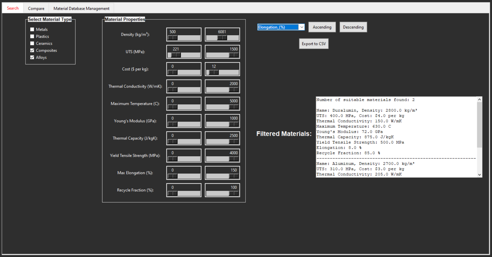
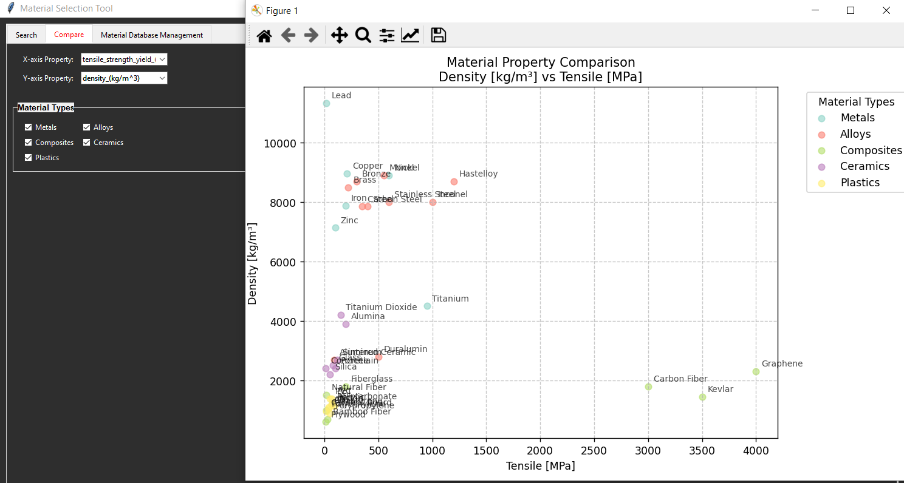

# Material Filter and selection Tool

This Python script filters materials based on various properties and enables visualization of selected property relations, using data from a CSV file (`materials_data.csv`).

## Features

- **Filtering by Properties**: Easily filter materials based on specified criteria, such as ranges or specific values for different material properties and material types.
- **Graphing Relationships**: Generate graphs to explore the relationship between two properties to visualize and identify optimal material relationships.
- **Expandable database**: Easily expand or modify the database by modifying materials_data.csv.

## Requirements

For Python script:

- Python 3.x
- Libraries: `csv`, `matplotlib`, `tkinter`, `numpy`

For the executable Material_selector.exe

- No requirements

## Usage

1. **Data Preparation**: Ensure `materials_data.csv` is in the same directory as the script and the .exe. The CSV should include headers for each material property.

2. **Filtering Materials**:

   - Run the script and specify the desired property filters by changing the sliders.
   - The script will output a list of materials that match the given criteria in the right panel.

3. **Visualizing Relationships**:
   - Choose two properties to plot.
   - A scatter plot will be generated to show the relationship, helping to identify trends or optimal values.

## Examples

